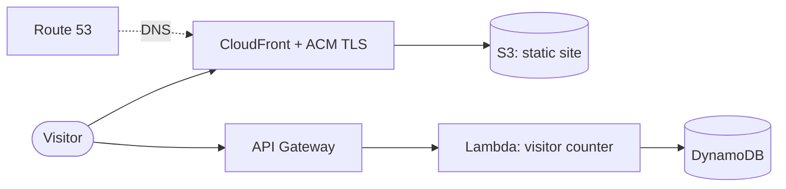

# Cloud Resume: Serverless Portfolio on AWS

A personal portfolio and CV site running fully serverless on AWS, provisioned end to end with Terraform and deployed through a keyless GitHub Actions pipeline.

Live site: https://yogeshparihar.com


## Overview

This project serves a static portfolio site with a small serverless backend for a live visitor counter. Every piece of infrastructure is defined as code with Terraform, and every push to the `main` branch deploys the site automatically. Deployments authenticate to AWS with short-lived credentials issued through GitHub OIDC, so no long-lived AWS keys are stored anywhere.

## Architecture



CloudFront serves the static site from a private S3 bucket over HTTPS, using an Origin Access Control so the bucket itself is never public. The visitor counter is a separate path: the browser calls an API Gateway endpoint, which invokes a Lambda function that atomically increments a counter in DynamoDB and returns the new total.

## Tech stack

- Compute: AWS Lambda (Python 3.12)
- API: Amazon API Gateway (HTTP API)
- Storage: Amazon S3 (static hosting), Amazon DynamoDB (on-demand visitor counter)
- Delivery and TLS: Amazon CloudFront with AWS Certificate Manager
- DNS: Amazon Route 53
- Infrastructure as code: Terraform
- CI/CD: GitHub Actions with OIDC

## Repository structure

```
.
├── .github/workflows/deploy.yml   CI/CD pipeline
├── frontend/                      Static site (HTML, CSS, JS, assets)
├── src/                           Lambda function (visitor counter)
└── terraform/                     Infrastructure as code
```

## How it works

The front end is plain HTML, CSS and JavaScript, kept deliberately simple and framework-free for a single-page site. On page load, the browser sends one request to the API Gateway endpoint. The Lambda function runs a single DynamoDB `UpdateItem` call that increments the visit count and returns it, so the count shown is always current without any server to manage.

## Infrastructure

All resources are managed by Terraform. State is stored in a remote S3 backend with native state locking. The AWS provider is aliased so that the CloudFront TLS certificate is created in `us-east-1` (a CloudFront requirement) while the rest of the stack runs in `eu-central-1`. IAM policies follow least privilege throughout.

## CI/CD

The pipeline in `.github/workflows/deploy.yml` runs on every push to `main` that changes the site. It assumes a least-privilege IAM role through a GitHub OIDC identity provider (no stored secrets), syncs the `frontend/` directory to S3, and invalidates the CloudFront cache so changes go live immediately.

## Running it yourself

Prerequisites: an AWS account, the AWS CLI configured with credentials, and Terraform installed.

```
cd terraform
terraform init
terraform plan
terraform apply
```

Then upload the site content:

```
aws s3 sync ../frontend/ s3://<your-site-bucket>/ --delete
```